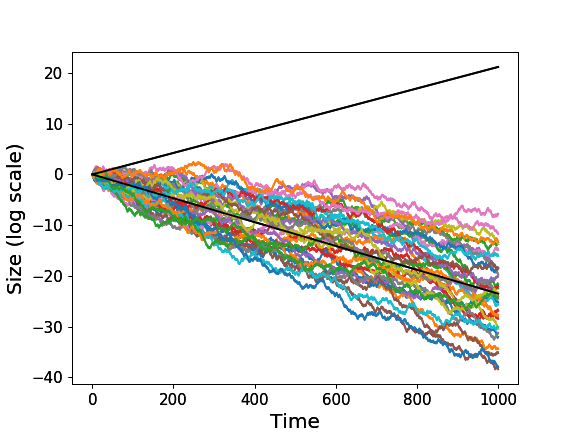
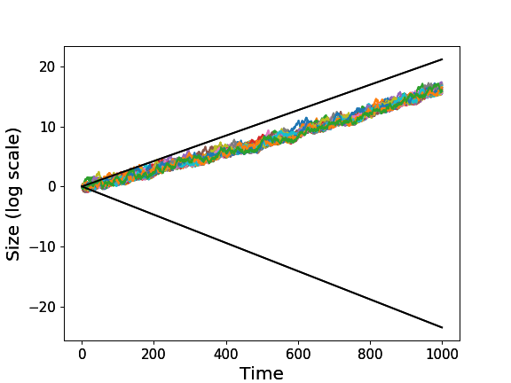

**It was considered an established truth that cooperation required some kind of altruistic behavior to evolve**.
Indeed, one of the most important theorists of the evolution of cooperation, Martin Nowak, analyse in one of the most prestigious scientific journals, Nature, a set of relevant rules for the evolution of cooperation ([here](https://www.ncbi.nlm.nih.gov/pmc/articles/PMC3279745/pdf/nihms49939.pdf)).
All the rules summarized a benefit-to-cost ratio of an *altruistic* act with respect to some critical value.
At the end of the paper, he claimed that the most remarkable aspect of evolution is its ability to generate cooperation in a competitive world.
We will see that his surprise can only arise if **we are implicitly assuming that evolutionary systems are *ergodic*.**
If you don't know what does ergodic mean, go ahead.

Evolutionary processes are essentially temporary processes.
In evolutionary theory everyone is taught the fact that lineage growth is a multiplicative and noisy process: a sequence of survival and reproductive probabilities.
In the filed, we make use of mathematics to analyze what happens to a genetic or cultural lineage over time.
For this purpose **we represent the real environment through a stochastic function**.
For example, consider the following toy environment.
Nature toss a coin.
For heads your community grows 50% of their current size.
For tails your community lose 40% of their members.

```python
def environment(size):
    if np.random.random() <= 0.5:
        res = 1.5*size
    else:
        res = 0.6*size
    return res
```

The question, now, is how to analyse the stochastic function in order to **find the expected outcome**, i.e. what will happen to agents typically.
The development of probability theory was motivated by this purpose.

The original treatment (Pascal-Fermat-Huygens) states that the expected outcome can be found by multiplying each possible change in size by its probability of occurrence, and add everything.
Let $\Delta(s)$ be the change in size at state $s$ and $p(s)$ the probability of state $s$, then the expected outcome will be.

$$\text{expected outcome} = \sum_s p(s)\Delta(s)$$

If we analyze the toy environment, we will find that the expected outcome will have a positive change, $0.05\Delta = 0.5 0.5\Delta + 0.5 (-0.4)\Delta$.
However, even if we consider members as a continuous variable, what really happens over time is very different from what is expected.



**The expectation over states does not reflect what really happens with the individual agents over time.**
**This is because we are facing a multiplicative process (Yaarin 2010).**
In the multiplicative process the real physical impacts of losses are often stronger than those of gains.
If there is even one zero in the sequence of generations, we are extinct.
Comparing what happens over time to what happens in expectation is a well-known problem in statistical mechanics, called "the ergodicity problem".
A system is ergodic if its time average equals its expectation value.

**One consequence is that variance in fitness realy matters**.
**An effective way to reduce variance is to cooperate, by sharing members between communities.**
The anthropologist Claude Lévi-Strauss developed a general argument for the universality of the incest taboo in human societies.
His argument begins with the claim that the incest taboo is in effect a prohibition against endogamy, and the effect is to encourage exogamy. Through exogamy, otherwise unrelated households or lineages will form relationships through marriage, thus strengthening social solidarity.

To experiment the effect of a this kind of rules, we define a toy incest taboo rule, in which a percentage of the community must migrate to other unrelated housholds.

```python
def incest_rule(communities_size,exogamy=0.05):
    res = []
    migration_per_community = exogamy*sum(communities_size)/len(communities_size)
    for c in range(len(communities_size)):
        res.append( communities_size[c]*(1-exogamy) + migration_per_community )
    return res 
```

If the previous communities, in the same environment, applied a 5% of exogamy we would observe the following behavior.



Multiplicative process offers a concrete physical advantage in favor of cooperative behavior.
**The "ergodic" point of view had major implications for all evolutionary science.**
**Perhaps the most significant change lies in the nature of the model human that arises from our conceptual reframing (Peters 2019).**
Observed behaviour deviates starkly from the predictions made by the Homo economicus model.
Paired with a firm belief in its models, this has led to a narrative of human irrationality in large parts of economics.
If humans evolved in non-ergodic environments they should be able to intuitively evaluate and adapt to the temporal consequences of the different scenarios, as the copenhagen experiment seems to have shown (Meder 2019).
A the new "Homo ergodicus" now fit human behavior, which usually cares about others, understands that cooperation leads to better results, and is patient and kind.


## References

- Nowak, M. 2006. Five rules for the evolution of cooperation. Nature.
- Peters, O. 2019. The ergodicity problem in economics. Nature.
- Yaarin, G. 2010. Cooperation evolution in random multiplicative environments. The European Physical Journal B.
- Meder, D. et al. 2019. Ergodicity-breaking reveals time optimal economic behavior in humans (v2). ArXiv.
